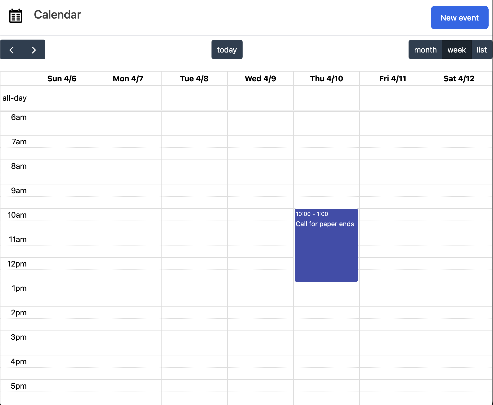

# Async remote events from the ONS suite

This is a demonstration repository. If you don't want to use docker for your remote
resources, this is a nice and lightweight alternative.

We use a local openapi server in the Procfile to generate a server built from your
consuming appia.yml

NB: The fullcalendar backend controller code is a bit hacky / vibe coded,
that's not the purpose of this repo.

The appia wrappers are in the `app/concerns` folder and contain some logic to convert
remote json to fullcalendar event json. It can be done in a nicer way but that's
outside the scope of this project.

Most of the remote info is in the `/openapi` folder. I'm a bit on the fence on creating
separate files for each schema, so in presence logs they're all in one file.

The groupcare API is deprecated, hence it's not used.

## Why this and not amoretto?

* amoretto yml files are static copies, not in sync with openapi spec
* appia bot keeps yml files up to date
* you get errors when e.g. you call an endpoint without required parameters
* no duplication

## Start

* `./bin/setup`
* `./bin/dev`
* Go to `http://localhost:3000` to view calendar or `http://localhost:9000/openapi.json`
to check your remote server!

## TODO

* Dates in schemas are currently static!
* Nice mocks for spec / test
* Add urls for staging / production in consuming.yml
